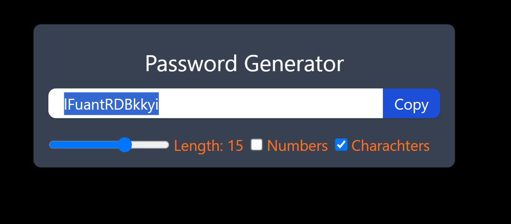

# Project: React-Hooks-With-Optimzation ( React + Vite )

### KEY Takeaways

- Run the methods on page loading
- Dependencies are present like check the box of "Numbers", check the box of "Letters". On checking, the method should automatically run.And running it again is not simple but Optimizing it is the main thing.
- Targetting a particular field/ element using Hooks.

This template provides a minimal setup to get React working in Vite with HMR and some ESLint rules.

Currently, two official plugins are available:

- [@vitejs/plugin-react](https://github.com/vitejs/vite-plugin-react/blob/main/packages/plugin-react/README.md) uses [Babel](https://babeljs.io/) for Fast Refresh
- [@vitejs/plugin-react-swc](https://github.com/vitejs/vite-plugin-react-swc) uses [SWC](https://swc.rs/) for Fast Refresh
